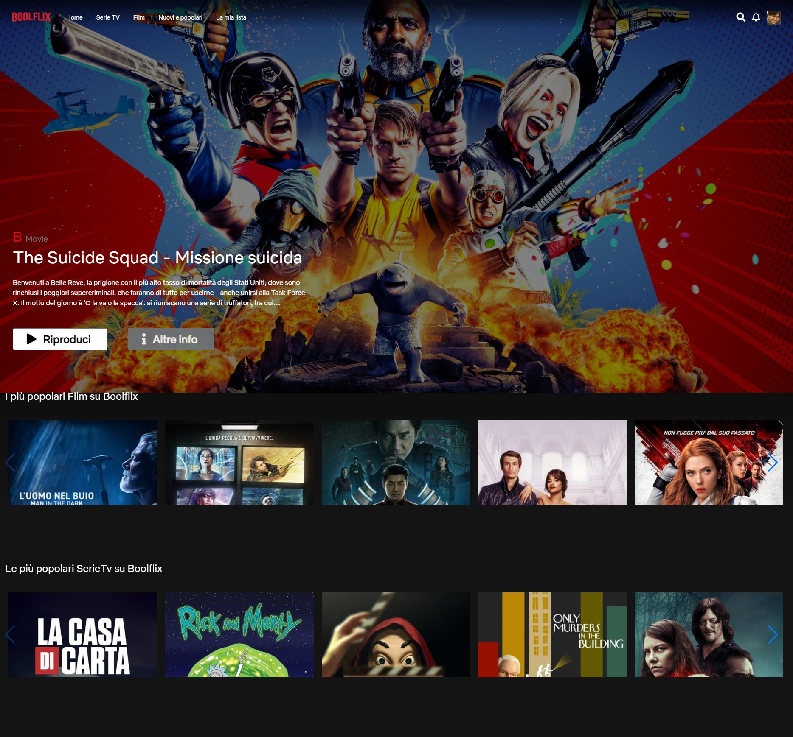

<h1>Progetto BoolFlix</h1>
<h3>Elenco di Film/SerieTV provenienti da API con possibilità di ricerca</h3>

<em>Gli Elementi sono reattivi all'hover con la possibilità di visualizzare altre informazioni inerenti all'elemento.</em>

Linguaggi utilizzati:

<ul>
<li>HTML</li>
<li>SCSS</li>
<li>Javascript</li>
</ul>

Framework utilizzati:

<ul>
<li>Vue</li>
</ul>

Librerie utilizzate:

<ul>
<li>Axios</li>
</ul>

Anteprima

